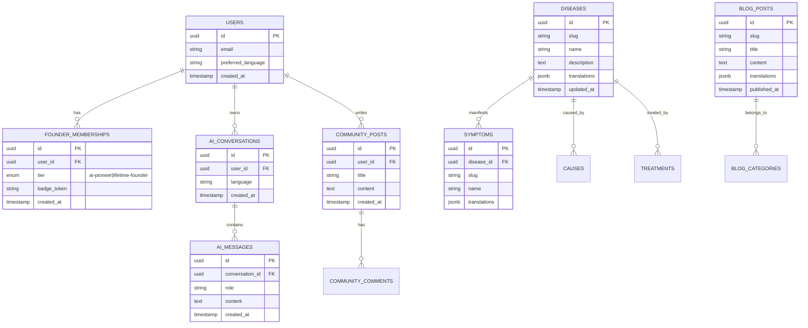

# SynoChain AI 技术架构文档

## 1. 架构设计

```mermaid
flowchart TD
    subgraph "用户层"
        "Web 用户"
        "移动端用户"
    end

    subgraph "前端层 Cloudflare Pages"
        "Astro 静态页面 SEO 内容"
        "React 组件 交互功能"
        "AI Health Assistant UI"
    end

    subgraph "AI 服务层"
        "AI API Server 推理服务"
        "AI Content Generator 内容生成"
        "SEO Page Builder 页面构建"
    end

    subgraph "数据层 Supabase"
        "PostgreSQL 数据库"
        "用户系统 Auth"
        "Storage 文件存储"
        "Disease DB 疾病库"
        "Keyword DB 关键词库"
        "AI Prompt DB 提示词库"
    end

    "Web 用户" --> "Astro 静态页面"
    "Web 用户" --> "React 组件"
    "移动端用户" --> "React 组件"
    "Astro 静态页面" --> "PostgreSQL 数据库"
    "React 组件" --> "AI API Server"
    "AI API Server" --> "AI Prompt DB"
    "AI API Server" --> "Disease DB"
    "AI Content Generator" --> "PostgreSQL 数据库"
    "AI Content Generator" --> "SEO Page Builder"
    "SEO Page Builder" --> "Astro 静态页面"
    "React 组件" --> "用户系统 Auth"
```

## 2. 技术选型说明

- **前端框架**: Astro + React 集成
  - Astro 负责 SEO 内容页面（静态生成，1000-10000 页面）
  - React 负责交互组件（AI 助手、搜索、支付等）
- **样式方案**: Tailwind CSS + CSS 变量（白底主题，模块化设计）
- **国际化**: astro-i18n + react-i18next（多语言切换）
- **初始化工具**: `npm create astro@latest`
- **后端服务**: Supabase（提供 PostgreSQL + Auth + API + Storage）
- **部署平台**: Cloudflare Pages（通过 GitHub 自动部署）
- **AI 服务**: 外部 AI API（OpenAI / Claude 等，通过 API Server 调用）

### 技术选型原因

| 技术 | 选择原因 |
|------|----------|
| Astro | SEO 极强，适合海量静态页面，岛屿架构按需加载 React |
| React | 生态成熟，组件复用性强，适合复杂交互 |
| Tailwind CSS | 快速开发，原子化样式便于模块化维护 |
| Supabase | 开源 Firebase 替代，PostgreSQL 强大，自带 Auth |
| Cloudflare Pages | 全球 CDN，免费额度大，与 GitHub 无缝集成 |

## 3. 路由定义

| 路由 | 用途 | 页面类型 |
|------|------|----------|
| `/` | 首页（Hero、众筹、工具导航） | Astro 静态 |
| `/[locale]/` | 多语言首页 | Astro 静态 |
| `/[locale]/ai-tools` | AI 健康助手 | Astro + React 岛屿 |
| `/[locale]/conditions` | 疾病库目录 | Astro 静态 |
| `/[locale]/conditions/[slug]` | 疾病详情页 | Astro 静态 |
| `/[locale]/symptoms` | 症状搜索 | Astro + React 岛屿 |
| `/[locale]/symptoms/[slug]` | 症状详情页 | Astro 静态 |
| `/[locale]/causes` | 病因分析 | Astro 静态 |
| `/[locale]/natural-health` | 自然健康 | Astro 静态 |
| `/[locale]/nutrition` | 营养知识 | Astro 静态 |
| `/[locale]/health-tests` | 健康测试 | Astro + React 岛屿 |
| `/[locale]/blog` | 博客列表 | Astro 静态 |
| `/[locale]/blog/[slug]` | 博客详情 | Astro 静态 |
| `/[locale]/community` | 社区 | Astro + React 岛屿 |
| `/[locale]/crowdfunding` | 众筹详情 | Astro + React 岛屿 |
| `/[locale]/founder` | Founder 会员支付 | React 岛屿 |
| `/api/ai-chat` | AI 对话接口 | API 路由 |
| `/api/crowdfunding` | 众筹数据接口 | API 路由 |

## 4. API 定义

### 4.1 AI 健康助手接口

```typescript
// POST /api/ai-chat
interface AIChatRequest {
  message: string;
  language: 'en' | 'zh' | 'es' | 'ja';
  conversationId?: string;
  userId?: string;
}

interface AIChatResponse {
  reply: string;
  suggestedQuestions: string[];
  references?: Array<{
    title: string;
    url: string;
  }>;
  disclaimer: string;
}
```

### 4.2 众筹数据接口

```typescript
// GET /api/crowdfunding/stats
interface CrowdfundingStats {
  totalRaised: number;
  supporterCount: number;
  daysRemaining: number;
  goal: number;
}

// POST /api/crowdfunding/support
interface SupportRequest {
  tier: 'ai-pioneer' | 'lifetime-founder';
  email: string;
  paymentMethod: string;
}

interface SupportResponse {
  success: boolean;
  orderId: string;
  badgeToken?: string;
}
```

### 4.3 国际化内容接口

```typescript
// GET /api/content/[type]/[slug]?lang=en
interface ContentResponse {
  title: string;
  content: string;
  sections: Array<{
    heading: string;
    body: string;
  }>;
  relatedItems: string[];
  lastUpdated: string;
}
```

## 5. 服务端架构图（Supabase + API Routes）

```mermaid
flowchart LR
    subgraph "Cloudflare Pages Functions"
        "API Routes 处理器"
    end

    subgraph "Supabase"
        "Auth Service 认证"
        "PostgreSQL 数据库"
        "RLS 行级安全"
        "Storage 文件"
    end

    subgraph "外部 AI 服务"
        "AI Provider API"
    end

    "客户端请求" --> "API Routes 处理器"
    "API Routes 处理器" --> "Auth Service"
    "API Routes 处理器" --> "PostgreSQL 数据库"
    "API Routes 处理器" --> "AI Provider API"
    "Auth Service" --> "RLS"
    "RLS" --> "PostgreSQL 数据库"
```

## 6. 数据模型

### 6.1 数据模型定义



### 6.2 数据定义语言

```sql
-- 用户表（扩展 Supabase auth.users）
CREATE TABLE public.profiles (
    id UUID PRIMARY KEY REFERENCES auth.users(id) ON DELETE CASCADE,
    email TEXT NOT NULL,
    preferred_language TEXT DEFAULT 'en',
    display_name TEXT,
    avatar_url TEXT,
    created_at TIMESTAMPTZ DEFAULT NOW()
);

-- Founder 会员表
CREATE TABLE public.founder_memberships (
    id UUID PRIMARY KEY DEFAULT gen_random_uuid(),
    user_id UUID REFERENCES public.profiles(id) ON DELETE CASCADE,
    tier TEXT NOT NULL CHECK (tier IN ('ai-pioneer', 'lifetime-founder')),
    badge_token TEXT UNIQUE,
    nft_token_id TEXT,
    payment_amount NUMERIC(10,2) NOT NULL,
    created_at TIMESTAMPTZ DEFAULT NOW()
);

-- 疾病库
CREATE TABLE public.diseases (
    id UUID PRIMARY KEY DEFAULT gen_random_uuid(),
    slug TEXT UNIQUE NOT NULL,
    name TEXT NOT NULL,
    description TEXT,
    translations JSONB DEFAULT '{}',
    category TEXT,
    created_at TIMESTAMPTZ DEFAULT NOW(),
    updated_at TIMESTAMPTZ DEFAULT NOW()
);

-- 症状表
CREATE TABLE public.symptoms (
    id UUID PRIMARY KEY DEFAULT gen_random_uuid(),
    disease_id UUID REFERENCES public.diseases(id) ON DELETE CASCADE,
    slug TEXT UNIQUE NOT NULL,
    name TEXT NOT NULL,
    description TEXT,
    severity TEXT,
    translations JSONB DEFAULT '{}'
);

-- AI 对话表
CREATE TABLE public.ai_conversations (
    id UUID PRIMARY KEY DEFAULT gen_random_uuid(),
    user_id UUID REFERENCES public.profiles(id) ON DELETE SET NULL,
    language TEXT DEFAULT 'en',
    created_at TIMESTAMPTZ DEFAULT NOW()
);

-- AI 消息表
CREATE TABLE public.ai_messages (
    id UUID PRIMARY KEY DEFAULT gen_random_uuid(),
    conversation_id UUID REFERENCES public.ai_conversations(id) ON DELETE CASCADE,
    role TEXT NOT NULL CHECK (role IN ('user', 'assistant', 'system')),
    content TEXT NOT NULL,
    created_at TIMESTAMPTZ DEFAULT NOW()
);

-- 博客文章表
CREATE TABLE public.blog_posts (
    id UUID PRIMARY KEY DEFAULT gen_random_uuid(),
    slug TEXT UNIQUE NOT NULL,
    title TEXT NOT NULL,
    content TEXT NOT NULL,
    excerpt TEXT,
    translations JSONB DEFAULT '{}',
    category TEXT,
    cover_image TEXT,
    published_at TIMESTAMPTZ,
    created_at TIMESTAMPTZ DEFAULT NOW()
);

-- 社区帖子表
CREATE TABLE public.community_posts (
    id UUID PRIMARY KEY DEFAULT gen_random_uuid(),
    user_id UUID REFERENCES public.profiles(id) ON DELETE CASCADE,
    title TEXT NOT NULL,
    content TEXT NOT NULL,
    category TEXT,
    upvotes INTEGER DEFAULT 0,
    created_at TIMESTAMPTZ DEFAULT NOW()
);

-- 启用行级安全
ALTER TABLE public.profiles ENABLE ROW LEVEL SECURITY;
ALTER TABLE public.founder_memberships ENABLE ROW LEVEL SECURITY;
ALTER TABLE public.ai_conversations ENABLE ROW LEVEL SECURITY;
ALTER TABLE public.ai_messages ENABLE ROW LEVEL SECURITY;
ALTER TABLE public.community_posts ENABLE ROW LEVEL SECURITY;

-- 公共可读策略（SEO 内容）
CREATE POLICY "Public can read diseases" ON public.diseases FOR SELECT USING (true);
CREATE POLICY "Public can read symptoms" ON public.symptoms FOR SELECT USING (true);
CREATE POLICY "Public can read blog_posts" ON public.blog_posts FOR SELECT USING (published_at IS NOT NULL);
```

## 7. 目录结构

```
synochain-ai/
├── src/
│   ├── pages/
│   │   ├── index.astro
│   │   ├── [locale]/
│   │   │   ├── index.astro
│   │   │   ├── ai-tools.astro
│   │   │   ├── conditions/
│   │   │   │   ├── index.astro
│   │   │   │   └── [slug].astro
│   │   │   ├── symptoms/
│   │   │   │   ├── index.astro
│   │   │   │   └── [slug].astro
│   │   │   ├── causes.astro
│   │   │   ├── natural-health.astro
│   │   │   ├── nutrition.astro
│   │   │   ├── health-tests.astro
│   │   │   ├── blog/
│   │   │   │   ├── index.astro
│   │   │   │   └── [slug].astro
│   │   │   ├── community.astro
│   │   │   └── crowdfunding.astro
│   │   └── api/
│   │       ├── ai-chat.ts
│   │       └── crowdfunding.ts
│   ├── components/
│   │   ├── layout/
│   │   │   ├── Header.astro
│   │   │   ├── Footer.astro
│   │   │   └── LanguageSwitcher.jsx
│   │   ├── home/
│   │   │   ├── Hero.astro
│   │   │   ├── CrowdfundingProgress.astro
│   │   │   ├── FundUsage.astro
│   │   │   ├── FounderTiers.astro
│   │   │   └── ToolsNav.astro
│   │   ├── ai/
│   │   │   ├── AIHealthChecker.jsx
│   │   │   └── ChatMessage.jsx
│   │   ├── common/
│   │   │   ├── SearchBox.jsx
│   │   │   ├── DiseaseCard.astro
│   │   │   └── Donation.jsx
│   │   └── ui/
│   │       ├── Button.astro
│   │       └── Card.astro
│   ├── i18n/
│   │   ├── ui.ts
│   │   ├── en.json
│   │   ├── zh.json
│   │   ├── es.json
│   │   └── ja.json
│   ├── lib/
│   │   ├── supabase.ts
│   │   ├── ai.ts
│   │   └── utils.ts
│   ├── layouts/
│   │   └── BaseLayout.astro
│   └── styles/
│       └── global.css
├── database/
│   └── schema.sql
├── scripts/
│   ├── generate-content.js
│   └── generate-pages.js
├── prompts/
│   ├── disease.txt
│   ├── symptom.txt
│   └── faq.txt
├── public/
│   └── images/
├── astro.config.mjs
├── tailwind.config.mjs
├── package.json
└── tsconfig.json
```
